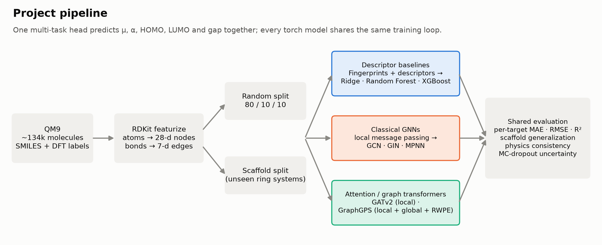

# QM9 Multi-Property Prediction: Classical GNNs vs. Graph Transformers

Predicting five quantum-chemical properties of small organic molecules directly
from their 2D structure, and comparing three model families under identical
conditions:

| Family | Models |
|---|---|
| Descriptor baselines | Ridge, Random Forest, XGBoost on RDKit descriptors + Morgan fingerprints |
| Classical GNNs | GCN, GIN (GINE), MPNN (NNConv + GRU) |
| Attention / graph transformers | GATv2, GraphGPS (local MPNN + global attention + random-walk PE) |

Every model is evaluated on both a **random split** and a **scaffold split**
(test molecules have ring systems never seen in training).

**📊 Results and analysis: [`RESULTS.md`](./RESULTS.md)**



## Highlights

- **Multi-task learning.** One shared encoder predicts dipole moment (μ),
  polarizability (α), HOMO, LUMO and the HOMO-LUMO gap together.
- **Scaffold generalization.** Bemis-Murcko scaffold split alongside the random
  split, reported separately.
- **Physics consistency.** Optional training penalty that enforces
  `gap = LUMO − HOMO` in physical units.
- **Uncertainty.** MC-dropout confidence estimates and confidence-vs-coverage
  curves.
- **Fair comparison.** All neural models share the same pooling, regression
  head, optimizer, LR schedule and early stopping; only the encoder differs.

## Headline results

Full QM9 (133k molecules), 60 epochs, single seed. The macro columns average
the five targets in raw units; the gap columns are HOMO-LUMO gap MAE in eV.
Per-property results and discussion are in [`RESULTS.md`](./RESULTS.md).

| Model | Family | Params | Random MAE ↓ | Random R² ↑ | Scaffold MAE ↓ | Scaffold R² ↑ | Gap MAE random / scaffold (eV) |
|---|---|---:|---:|---:|---:|---:|---:|
| Ridge | Baseline | – | 0.374 | 0.785 | 0.438 | 0.704 | 0.408 / 0.481 |
| Random Forest | Baseline | – | 0.284 | 0.845 | 0.549 | 0.568 | 0.300 / 0.641 |
| XGBoost | Baseline | – | 0.316 | 0.871 | 0.451 | 0.777 | 0.263 / 0.367 |
| GCN | GNN | 30k | 0.284 | 0.902 | 0.372 | 0.818 | 0.211 / 0.332 |
| GIN | GNN | 48k | 0.254 | 0.919 | 0.313 | 0.852 | 0.192 / 0.289 |
| MPNN | GNN | 850k | 0.221 | 0.938 | **0.300** | 0.863 | 0.154 / 0.277 |
| GATv2 | Attention | 48k | 0.390 | 0.876 | 0.359 | 0.841 | 0.249 / 0.319 |
| **GraphGPS** | Transformer | 182k | **0.205** | **0.942** | 0.325 | **0.876** | **0.147 / 0.255** |

**Key findings**
- Graph models beat fingerprint baselines. On unseen scaffolds, GraphGPS cuts
  gap error by 31% vs. the best baseline.
- GraphGPS is best on 9 of 10 property × split combinations, with ~5× fewer
  parameters than MPNN.
- Attention alone doesn't help: GATv2 (local attention) is the weakest graph
  model on the random split. Global attention plus structural encoding is
  what pays off.
- Random-split scores overstate performance on novel chemistry. Random Forest
  error nearly doubles on the scaffold split.


## Quickstart

### 1. Install

```bash
python -m venv .venv
source .venv/bin/activate          # Windows: .venv\Scripts\activate
pip install -r requirements.txt
```

For GPU training, install the CUDA build of PyTorch first from
[pytorch.org](https://pytorch.org/get-started/locally/), then install the rest.

### 2. Get the data

Download the raw QM9 dataset (one `.xyz` file per molecule) from
[figshare](https://springernature.figshare.com/collections/Quantum_chemistry_structures_and_properties_of_134_kilo_molecules/978904)
and convert it to a CSV with columns `mol_id, smiles, mu, alpha, homo, lumo, gap`:

```bash
python scripts/xyz_to_csv.py data/qm9_raw data/qm9_full.csv
```

`data/sample_qm9_5rows.csv` is a 5-molecule sample for smoke-testing only.

### 3. Run

```bash
# Smoke test: tiny model, a few epochs
python scripts/run_experiment.py --quick

# Fast dry run on a subset
python scripts/run_experiment.py --csv data/qm9_full.csv --max-rows 5000 --epochs 20

# Full experiment (all models, both splits)
python scripts/run_experiment.py --csv data/qm9_full.csv --epochs 150 --device cuda

# Per-target metrics, physics consistency, uncertainty curves from saved checkpoints
python scripts/eval_checkpoints.py --csv data/qm9_full.csv

# Regenerate every chart and diagram in docs/figures/
python scripts/make_figures.py
```

| Flag | Purpose |
|---|---|
| `--targets mu alpha homo lumo gap` | Properties to predict (CSV column names) |
| `--hidden 64 --layers 4` | Model width and depth |
| `--physics-loss` | Add the `gap = LUMO − HOMO` consistency penalty |
| `--skip-baselines` / `--skip-transformers` | Skip a phase on reruns |
| `--max-rows N` | Use only the first N molecules |
| `--out-dir results` | Where results and checkpoints are written |

Outputs: `results/combined_results.csv` (one row per model × split) and
`results/<model>_<split>.pt` checkpoints.

## How it works

1. **Featurize** (`src/featurize.py`) – RDKit parses each SMILES with explicit
   hydrogens; atoms become 28-d feature vectors (element, degree, charge,
   hybridization, aromaticity, H count) and bonds 7-d vectors (type,
   conjugation, ring membership).
2. **Split** (`src/data.py`) – random 80/10/10 and a Bemis-Murcko scaffold
   split where every scaffold lands in exactly one partition. Targets are
   z-scored using training statistics only.
3. **Baselines** (`src/models/baselines.py`) – 11 RDKit descriptors + 1024-bit
   Morgan fingerprint (radius 2) into Ridge, Random Forest and XGBoost.
4. **Classical GNNs** (`src/models/gnn.py`) – GCN (no bond features), GINE
   (sum aggregation + bond features), and edge-conditioned MPNN with GRU
   updates (Gilmer et al., 2017).
5. **Graph transformers** (`src/models/transformer.py`) – GATv2 (attention
   over bonded neighbours) and GraphGPS (Rampášek et al., 2022): local GINE
   message passing plus global multi-head self-attention, with a random-walk
   structural encoding so attention knows the graph topology.
6. **Training** (`src/train.py`) – AdamW, ReduceLROnPlateau, early stopping
   on validation MAE in physical units; optional physics loss
   (`src/physics_loss.py`) computed on de-standardized predictions.
7. **Evaluation** (`src/evaluate.py`) – per-target MAE / RMSE / R², MC-dropout
   uncertainty and coverage curves.


## Project layout

```
qm9_gnn/
├── data/                        # QM9 CSV goes here (not committed)
├── docs/figures/                # generated charts and diagrams
├── results/                     # metrics CSVs and checkpoints (not committed)
├── scripts/
│   ├── run_experiment.py        # train + evaluate every model on both splits
│   ├── eval_checkpoints.py      # per-target / physics / uncertainty analysis
│   ├── make_figures.py          # render docs/figures/
│   └── xyz_to_csv.py            # raw QM9 .xyz files -> CSV
├── src/
│   ├── featurize.py             # SMILES -> atom/bond features
│   ├── data.py                  # loading, splits, target scaling
│   ├── physics_loss.py          # gap = LUMO - HOMO penalty
│   ├── predict_utils.py         # shared inference helper
│   ├── train.py                 # shared training loop
│   ├── evaluate.py              # metrics, MC-dropout, coverage curves
│   └── models/
│       ├── common.py            # pooling + regression head
│       ├── baselines.py         # descriptor/fingerprint models
│       ├── gnn.py               # GCN, GIN, MPNN
│       └── transformer.py       # GATv2, GraphGPS
├── RESULTS.md                   # model comparison and findings
└── requirements.txt
```

## Limitations and future work

- **2D graphs only.** QM9 labels come from DFT-optimized 3D geometries;
  3D-aware models (SchNet, DimeNet++, PaiNN) are the natural next step and
  reach far lower errors in the literature.
- **Single seed, no hyperparameter search.** All models use one shared
  configuration (hidden 64, 4 layers); differences under ~5% are within noise.
- **Explainability** (GNNExplainer / atom attributions) is not implemented.
- **Deep ensembles** would likely give better-calibrated uncertainty than
  MC-dropout.

## References

- Ramakrishnan et al., *Quantum chemistry structures and properties of 134 kilo molecules*, Scientific Data (2014)
- Gilmer et al., *Neural Message Passing for Quantum Chemistry*, ICML (2017)
- Xu et al., *How Powerful are Graph Neural Networks?*, ICLR (2019)
- Brody et al., *How Attentive are Graph Attention Networks?*, ICLR (2022)
- Rampášek et al., *Recipe for a General, Powerful, Scalable Graph Transformer*, NeurIPS (2022)
