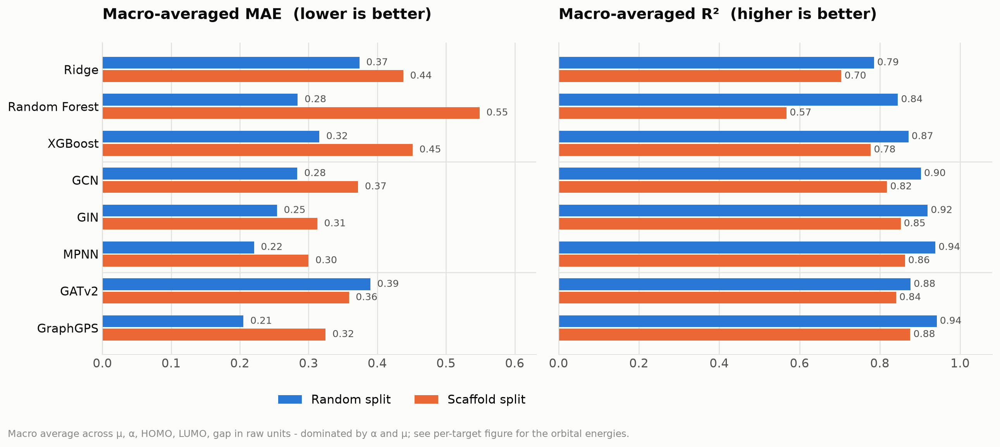
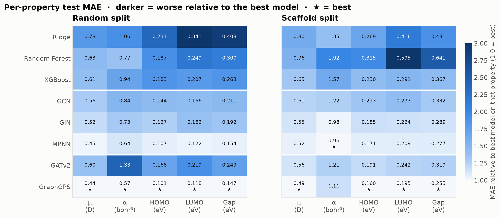
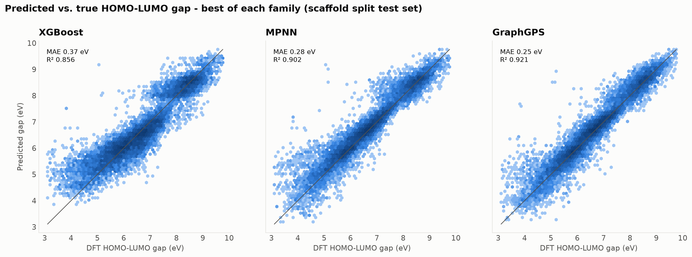
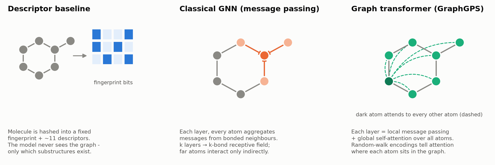
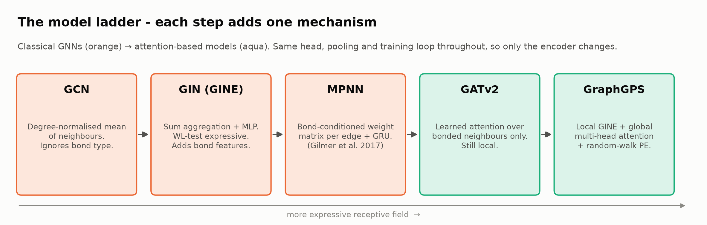
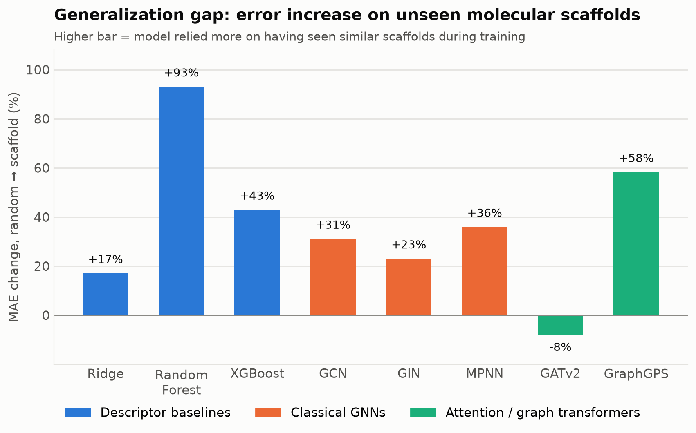
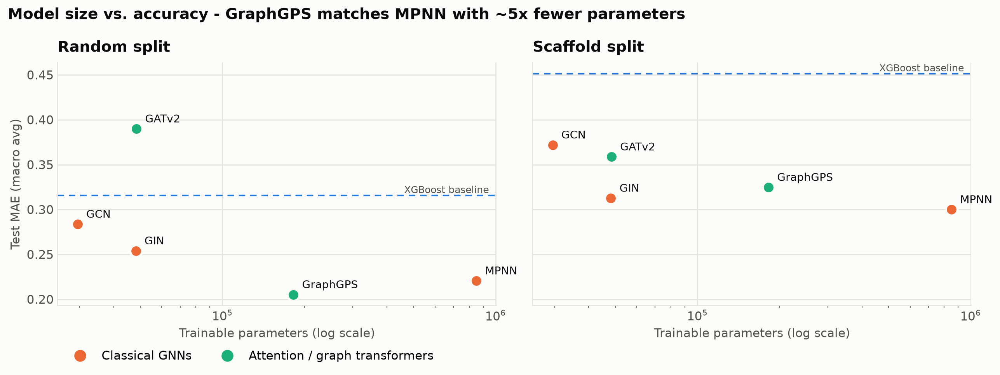
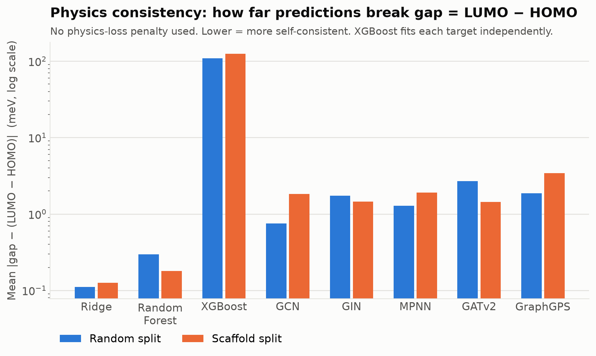
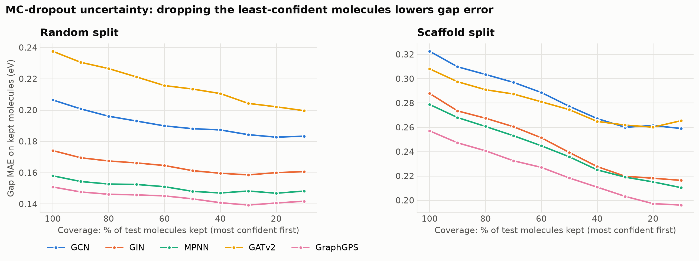

# Results: Descriptor Baselines vs. Classical GNNs vs. Graph Transformers

This document compares eight models on QM9 multi-property prediction and
explains what the results say about how each model family works. For setup and
usage see [`README.md`](./README.md). For design rationale see
[`PROJECT_CONTEXT.md`](./PROJECT_CONTEXT.md).

## TL;DR

1. **Graph models beat descriptor baselines.** GCN, GIN, MPNN and GraphGPS
   beat all three fingerprint baselines on μ, HOMO, LUMO and gap on both
   splits. On unseen scaffolds, GraphGPS has **31% lower HOMO-LUMO gap error
   than the best baseline** (0.26 vs 0.37 eV for XGBoost).
2. **GraphGPS is the most accurate model overall.** It is best on all five
   properties on the random split and on four of five on the scaffold split.
   It gets there with **~5× fewer parameters than MPNN** (182k vs 850k).
3. **Global attention needs structure to pay off.** GATv2, which is attention
   restricted to bonded neighbours, is the *weakest* graph model on the random split. The gain
   comes from GraphGPS combining local message passing, global attention, and
   random-walk structural encodings.
4. **Scaffold splits expose overfitting to familiar chemistry.** Every model
   gets worse on unseen scaffolds, and Random Forest degrades most (+93% MAE).
   Graph models still keep the best absolute scaffold accuracy and R².
5. **Neural models are almost physically consistent without being told.**
   Predicted `gap` matches `LUMO − HOMO` to within about 1–3 meV, roughly 1%
   of their gap error. XGBoost, which fits each target separately, breaks the
   relation by about 110 meV.
6. **Uncertainty estimates are informative, especially on new chemistry.**
   Keeping the 50% most confident scaffold-split molecules cuts gap error by
   11–17%.

## Experimental setup

| | |
|---|---|
| Data | QM9, 133,139 molecules (746 of 133,885 rows skipped as unparsable by RDKit) |
| Splits | Random 80/10/10 and Bemis-Murcko scaffold 80/10/10 (106,511 / 13,313 / 13,315 molecules) |
| Targets | μ (D), α (bohr³), HOMO, LUMO, gap (Hartree; shown in eV below) |
| Neural models | hidden 64, 4 layers (MPNN 3), mean+sum pooling, shared 3-layer MLP head, dropout 0.1 |
| Training | AdamW, lr 1e-3, batch 128, up to 60 epochs, ReduceLROnPlateau, early stopping on validation MAE (patience 15), seed 42, no physics loss |
| Baselines | 11 RDKit descriptors + 1024-bit Morgan fingerprint (r=2) → Ridge (α=1), Random Forest (300 trees), XGBoost (400 trees, depth 6) |
| Metrics | Test-set MAE / RMSE / R² per property, in physical units |

Reproduce with `scripts/run_experiment.py`, then `scripts/eval_checkpoints.py`
and `scripts/make_figures.py` (see README).

## 1. Overall comparison

Macro average over the five properties. This number is dominated by α and μ
because the properties are on different scales, so read it alongside the
per-property table below.

| Model | Family | Params | Random MAE ↓ | Random R² ↑ | Scaffold MAE ↓ | Scaffold R² ↑ |
|---|---|---:|---:|---:|---:|---:|
| Ridge | Baseline | – | 0.374 | 0.785 | 0.438 | 0.704 |
| Random Forest | Baseline | – | 0.284 | 0.845 | 0.549 | 0.568 |
| XGBoost | Baseline | – | 0.316 | 0.871 | 0.451 | 0.777 |
| GCN | GNN | 30k | 0.284 | 0.902 | 0.372 | 0.818 |
| GIN | GNN | 48k | 0.254 | 0.919 | 0.313 | 0.852 |
| MPNN | GNN | 850k | 0.221 | 0.938 | **0.300** | 0.863 |
| GATv2 | Attention | 48k | 0.390 | 0.876 | 0.359 | 0.841 |
| **GraphGPS** | Transformer | 182k | **0.205** | **0.942** | 0.325 | **0.876** |

## 2. Per-property results

**HOMO-LUMO gap MAE (eV)**, the most chemically meaningful target:

| Model | Random | Scaffold | Change |
|---|---:|---:|---:|
| Ridge | 0.408 | 0.481 | +18% |
| Random Forest | 0.300 | 0.641 | +114% |
| XGBoost | 0.263 | 0.367 | +40% |
| GCN | 0.211 | 0.332 | +57% |
| GIN | 0.192 | 0.289 | +51% |
| MPNN | 0.154 | 0.277 | +80% |
| GATv2 | 0.249 | 0.319 | +28% |
| **GraphGPS** | **0.147** | **0.255** | +73% |

What the heatmap shows:

- **GraphGPS wins 9 of 10 property × split cells.** The exception is α on the
  scaffold split, where MPNN (0.96) and GIN (0.98) beat GraphGPS (1.11). That
  one cell is why MPNN edges out GraphGPS on the scaffold macro average even
  though GraphGPS is better on μ, HOMO, LUMO and gap.
- **μ (dipole moment) is the hardest property** (R² 0.44–0.81). The dipole
  depends on 3D geometry and charge distribution, which a 2D bond graph
  captures only indirectly. This is where the gap between 2D and 3D models is
  largest in the literature.
- **α (polarizability) is the easiest** (R² ≥ 0.95 random). It scales mostly
  with molecule size and electron count, so even Ridge does well. That is
  also why mean+sum pooling matters: the sum term keeps size information.

The parity plots show *how* the models fail. XGBoost's predictions are
compressed toward the mean: it over-predicts small gaps (4–5 eV) and
under-predicts large ones. The graph models track the diagonal across the
whole range, with most errors in the sparse low-gap region (conjugated and
aromatic molecules).

## 3. How each model works, and what the results say about it

### Descriptor baselines: Ridge, Random Forest, XGBoost

Each molecule becomes a fixed 1,035-number vector: which small substructures
exist (Morgan bits) plus a few global descriptors. The model never sees how
the substructures are connected.

- **Ridge** is a regularized linear model. It is the weakest baseline on the
  random split but degrades *least* on scaffolds (+17%). A linear model can't
  memorize specific scaffolds, so it has less to lose.
- **Random Forest** averages 300 deep trees. It is competitive on the random
  split (macro MAE equal to GCN) but collapses on scaffolds (+93%, R² 0.57).
  Deep trees effectively look up "molecules with these bits in training", and
  that lookup fails when the ring system is new. **This is the clearest
  example of interpolation being mistaken for learning.**
- **XGBoost** builds boosted trees one after another. It is the best baseline
  on μ, HOMO, LUMO and gap on both splits. Ridge has a slightly lower
  scaffold macro MAE only because of α. Boosting with shallow
  trees generalizes better than deep bagged trees, but it is still limited by
  the fixed fingerprint.

### Classical GNNs: GCN → GIN → MPNN

Atoms pass messages along bonds. Each layer extends an atom's view by one bond.

- **GCN** averages neighbour features with fixed weights and **cannot see
  bond types**. It is the weakest message-passing model, but still beats every
  baseline on the scaffold split. Learning from the graph structure itself
  already helps generalization.
- **GIN** sums neighbours, passes them through an MLP, and adds bond features.
  It improves on GCN on every property (−10% macro MAE random, −16%
  scaffold). Summing keeps neighbour counts that averaging loses, and bond
  order matters for orbital energies.
- **MPNN** generates a separate transformation for each bond from its
  features and uses a GRU update. It is the best classical model and the best
  on scaffold-split α, but it needs **850k parameters**, 17× GIN.

**Lesson:** each step up the classical ladder helped. Adding bond information
and sum aggregation (GCN → GIN) improved every property on both splits, and
MPNN's bond-conditioned messages added a further gain at a large parameter cost.

### Attention models: GATv2 and GraphGPS

- **GATv2** replaces fixed neighbour weights with learned attention, but still
  only over bonded neighbours. It underperforms even GCN on the random split
  (0.390 vs 0.284 macro MAE), mostly because of α (1.33 vs 0.84). Molecules
  in QM9 have at most 9 heavy atoms, and most atoms have 1–4 neighbours, so
  there is little to "choose between" and attention mostly adds noise and
  optimization difficulty. Its scaffold MAE being *lower* than its random MAE
  (−8%) is an artifact of that weak α fit on the random split. On HOMO, LUMO
  and gap it degrades on scaffolds like every other model.
- **GraphGPS** runs GINE message passing (local) and multi-head
  self-attention over all atoms (global) in parallel in every layer, with
  random-walk encodings that tell attention where each atom sits in the
  graph. It is the best model overall. Global attention lets distant atoms
  interact in one step, which helps whole-molecule properties like the dipole
  moment (best μ on both splits).

**Lesson:** "attention" by itself isn't what helps. GATv2, which only adds
attention, is the worst graph model; GraphGPS, which adds *global* attention
**plus structural encoding** on top of a strong local MPNN, is the best.

## 4. Generalization to unseen scaffolds

- All models are worse on the scaffold split, so the random split
  overestimates real-world accuracy for novel chemistry. **Report both.**
- Graph models keep the best absolute scaffold performance. GraphGPS
  scaffold R² (0.876) exceeds XGBoost's *random-split* R² (0.871).
- GraphGPS and MPNN have larger *relative* drops (+58% and +36% macro MAE)
  than GIN (+23%). Higher-capacity models fit training scaffolds more closely.
  They still end up best in absolute terms, but part of their random-split
  advantage is scaffold-specific. Regularization, or training on more diverse
  scaffolds, would be the lever here.

**Parameters are not the story.** MPNN has 4.7× more parameters than GraphGPS
and is less accurate on the random split. GIN at 48k parameters is within 4%
of MPNN on the scaffold split (0.313 vs 0.300).

## 5. Physics consistency

This measures the mean |predicted gap − (predicted LUMO − predicted HOMO)|.
None of these models used the physics-loss penalty.

| Model | Random (meV) | Scaffold (meV) |
|---|---:|---:|
| Ridge | 0.1 | 0.1 |
| Random Forest | 0.3 | 0.2 |
| XGBoost | **109** | **124** |
| GCN / GIN / MPNN / GATv2 / GraphGPS | 0.8 – 2.7 | 1.4 – 3.4 |
| *DFT labels themselves (rounding)* | *0.7* | *0.7* |

Why the results come out like this:

- **Ridge and Random Forest are consistent by construction.** Ridge
  predictions are a linear function of the training labels, and a single
  multi-output Random Forest averages the same training molecules for every
  target. If the labels satisfy `gap = LUMO − HOMO`, so do the predictions.
- **XGBoost breaks it** because `MultiOutputRegressor` trains five
  independent boosted models whose errors don't cancel. Its violation (about
  110 meV) is 40% of its own gap error.
- **The neural models share one encoder**, so they learn a near-consistent
  representation on their own. The violation is about 1% of their gap MAE,
  and only a few times the 0.7 meV rounding noise in the dataset's own labels.

**Implication for the physics loss:** with a shared multi-task encoder, the
unpenalized models are already nearly consistent, so the `--physics-loss`
penalty has little room to improve consistency. Its value would show up
mainly in low-data regimes or with independent per-target models. That
ablation is a good next experiment.

## 6. Uncertainty (MC-dropout)

Each neural model makes 20 stochastic forward passes with dropout active. The
spread of those predictions is its uncertainty. Test molecules are ranked by
uncertainty, and error is measured on the most confident fraction.

Gap MAE reduction when keeping the most confident 50%:

| Model | Random | Scaffold |
|---|---:|---:|
| GCN | −9% | −14% |
| GIN | −7% | −17% |
| MPNN | −6% | −15% |
| GATv2 | −10% | −11% |
| GraphGPS | −5% | −15% |

- The uncertainty signal is **real but modest**. Error falls steadily as
  low-confidence molecules are removed.
- It is **about twice as useful on the scaffold split**. The model is more
  often "unsure for the right reason" when a molecule is unlike its training
  data, which is exactly when you'd want to route it to a DFT calculation
  instead.
- The curves flatten below ~30% coverage, and dropout is applied only in the
  regression head (p = 0.1). Deep ensembles or dropout throughout the encoder
  would likely give a sharper signal.

## 7. Limitations

- **Single seed, one shared hyperparameter setting.** Differences under ~5%
  (e.g. MPNN vs GIN on the scaffold split) may not be significant. Multiple
  seeds would give error bars.
- **60-epoch budget.** Some models were likely still improving; longer
  training would reduce all neural errors.
- **2D graphs only.** Published 3D-aware models (SchNet, DimeNet++, PaiNN)
  that use QM9's atomic coordinates report gap errors of roughly 0.03–0.07 eV,
  versus 0.15 eV here. The comparison in this project is *within* 2D models.
- **Macro-averaged MAE mixes units.** Use the per-property tables for claims
  about specific properties.

## 8. Key takeaways

| Question | Answer from this project |
|---|---|
| Do GNNs beat fingerprints? | Yes. GCN, GIN, MPNN and GraphGPS beat every baseline on μ, HOMO, LUMO and gap on both splits; the only exception is α on the random split, where Random Forest beats GCN and GATv2. |
| Do graph transformers beat classical GNNs? | GraphGPS does, narrowly (−7% MAE vs MPNN on random) and with 5× fewer parameters. Local-only attention (GATv2) does not. |
| What matters most in the architecture? | Bond-feature awareness (GCN → GIN), then global context with structural encoding (→ GraphGPS). |
| Does the random split tell the whole story? | No. Tree baselines look competitive on random splits and collapse on unseen scaffolds. |
| Are predictions physically consistent? | Yes for multi-task neural models (~1% of error) without any penalty; no for independently trained targets. |
| Can the model flag unreliable predictions? | Partly. MC-dropout confidence cuts scaffold-split error by ~15% at 50% coverage. |
